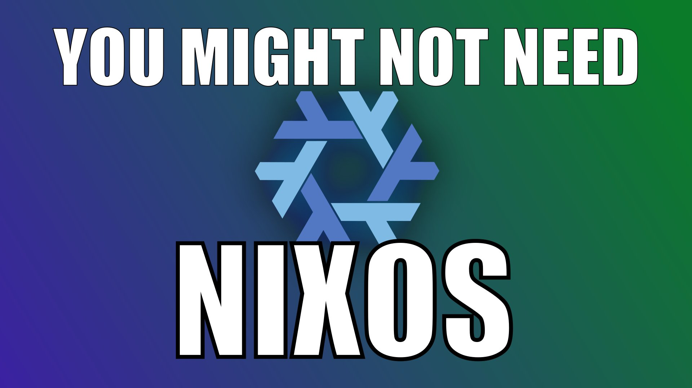

# 

NixOS is an extremely-hyped Linux distribution, which claims to offer many
advantages over other systems. As with all extremely-hyped things, I'm pretty
sure that it's overrated, and there are better alternatives,,,, right?

What did I discover? How does NixOS compare? Did it turn out that I was wrong
and NixOS is actually an excellent Linux distribution? You'll have to watch the
presentation to find out!

In this repository, you'll find the NixOS configuration I ended up with after my
2 weeks trying out NixOS, as well as the slides for my presentation to the UNSW
Linux Society on the topic.

## [Watch the presentation](https://youtu.be/46jtIh1Zs-Y)

A re-recording of the presentation is available on YouTube. Sadly the original
recording had audio quality issues, so I had to re-record it.

## Using my configuration

My configuration can be found within the `config` directory. By running the
`./rebuild.sh` script, it will be copied to `/etc/nixos` and installed.

Due to some pain-points I encountered with Flakes, you'll get a few errors due
to me using absolute paths to include flakes I wrote in my config. By updating
these paths, you should get it to install correctly.

However, even then, I think there are a few hardware-specific configurations in
there, which may not be ideal.

## Viewing my slides

I wrote my slides to be viewed with my extremely-janky home-made Windows
XP-themed slideshow viewer [Slides-XP](https://github.com/MaddyGuthridge/slides-xp).

If you use my Nix configuration, you can view the slides by running:

```sh
$ sxp --theme xp presentation
```

But if you'd prefer not to, you can install `slides-xp` and then run it yourself
with the same command, or run it directly with [`uvx`](https://docs.astral.sh/uv/):

```sh
$ uvx slides-xp -- sxp --theme xp presentation
```

Or you could just read the markdown.

## Credits

See [presentation/19.credits.md](./presentation/19.credits.md).
