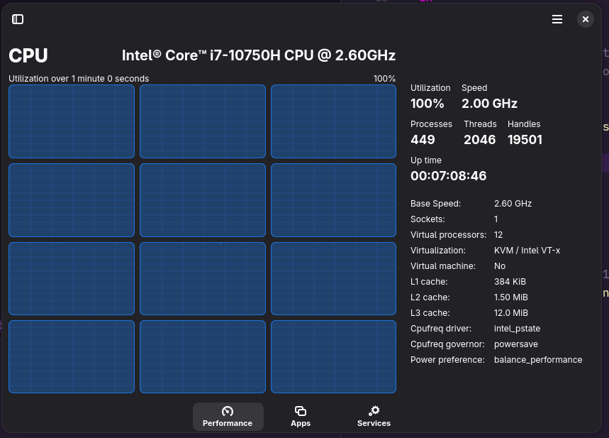

# I hope you like compiling

* While popular packages are cached, a lot of software ends up getting built
  from source.
  * ***NEVER TRY TO INSTALL CUDA***
* If you customise a package in any way, eg by telling it to add additional 
  dependencies, it will compile the entire package from source even if those 
  dependencies can be dynamically linked.
  * This might be a bug or a skill issue though
  * For example, I wanted to give VLC access to `libblurray` and `java` so it 
    could play Blu-rays, and so instead of downloading VLC and then adding the 
    dynamic library to its path, it decided to compile all of VLC and all of its 
    dependencies from source.
* When I updated to 25.11, it decided to compile Chromium from source.
* I had to cancel it after waiting almost 3 hours with no sign of stopping.

