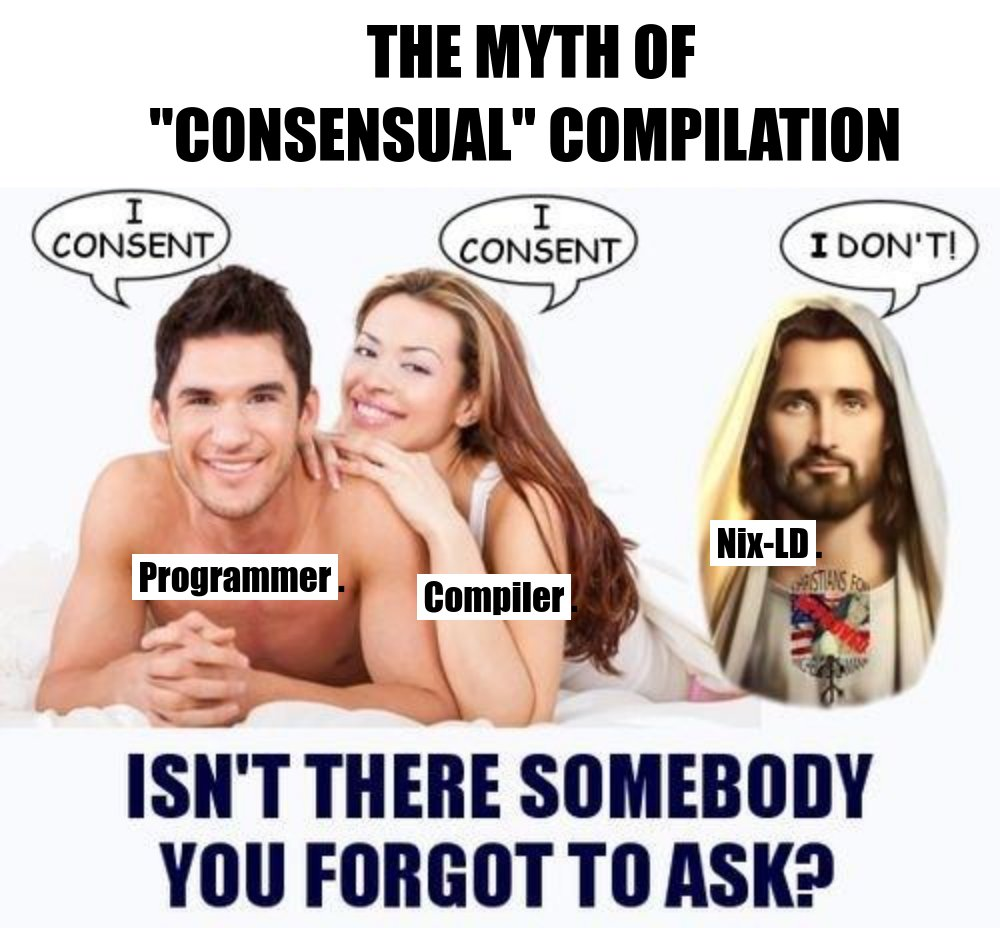

# What's it like for programming?

* Even then I was still completely unable to get it to work for some software.
* eg a tool I use that depends on PyQT, which straight up refused to build.
* I could spend (another) 3 hours debugging it and reading incomprehensible nix
  build errors, but I really don't feel like it.

